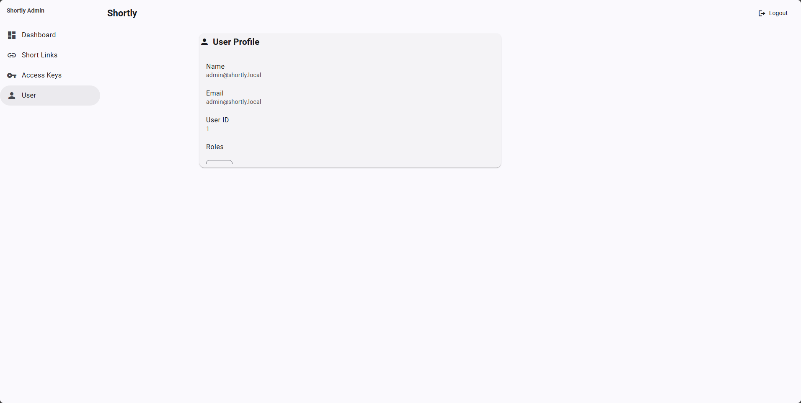
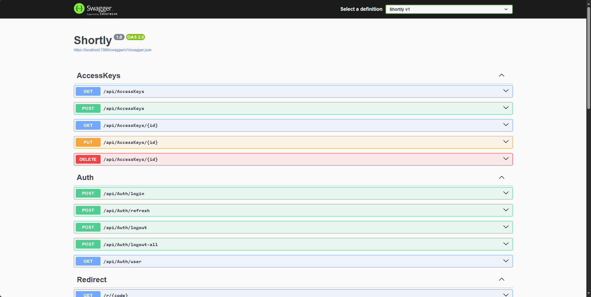

# Shortly — Reference App (Angular + ASP.NET Core + PostgreSQL)

A pragmatic, end-to-end reference project that demonstrates a **modern Angular 20** admin UI talking to an **ASP.NET Core** Web API with **Identity + JWT** authentication, **refresh tokens** via **HttpOnly cookies**, and **PostgreSQL** persistence. It’s intentionally simple, but structured so you can extend it into a production-ready product.

---

## Table of contents

- [What this project is](#what-this-project-is)
- [Features implemented](#features-implemented)
- [Roadmap (to prod-ready)](#roadmap-to-prod-ready)
- [Tech stack & rationale](#tech-stack--rationale)
- [Screenshots](#screenshots)
- [Prerequisites](#prerequisites)
- [Setup (from scratch)](#setup-from-scratch)
- [Configuration](#configuration)
- [Running locally](#running-locally)
- [API](#api)
- [Development notes](#development-notes)
- [Troubleshooting](#troubleshooting)
- [License](#license)

---

## What this project is

A **minimal but realistic** blueprint for building a secure SPA + API:

- **Frontend:** Angular 20 + Angular Material, guarded routes, JWT bearer, refresh-token flow, proxy for `/api` and `/r` during development.
- **Backend:** ASP.NET Core Web API, Identity, JWT Bearer auth, refresh tokens (HttpOnly cookie).
- **Database:** PostgreSQL + Entity Framework Core migrations.
- **Security-first defaults:** HTTPS in dev, strict cookie settings (`Secure`, `SameSite=None`, `HttpOnly`), CORS, and auth middleware ordering fixed.

The goal is clarity and **developer experience**. You can keep it lightweight or evolve it into a full product.

### What this app is (product view)

**Shortly** is a **private, self‑hosted URL shortener**. It’s meant for individuals that want **full ownership** of their data and links—without relying on third‑party SaaS. You run both the **admin UI** and the **redirect service** yourself. Create branded, memorable short links, manage access, and get basic analytics (clicks, referrers, countries).

Core goals:

- **Privacy & control** – Your links, tokens, and analytics live on your infrastructure.
- **Simplicity** – A small, understandable codebase you can adapt quickly.
- **Extensibility** – Clean domain boundaries and typed APIs make new features straightforward.

---

## Features implemented

- **Authentication**
  - Login with email/password (ASP.NET Core Identity)
  - **JWT access tokens** + **HttpOnly refresh token cookie** (`/api/auth/refresh` path, `Secure`, `SameSite=None`, `HttpOnly`)
  - Logout & logout-all (revokes refresh tokens)

- **Authorization**
  - JWT Bearer validation (issuer/audience/signing key via options)
  - Protected endpoints and Angular route guard

- **Short links**
  - CRUD for short links
  - Copy button (copies full redirect URL)
  - Redirect endpoint `/r/{code}` (absolute `Location` header normalization)

- **Access keys**
  - CRUD for access keys (optional `name`, active flag)

- **Dashboard**
  - Summary KPIs (total clicks, total clients)
  - Top referrers & countries (DB-side aggregation)

- **Dev ergonomics**
  - Angular **Material** (Azure Blue theme)
  - Proxy configured for `/api` and `/r`
  - HTTPS in dev with trusted local certs (see Troubleshooting)

---

## Roadmap (to prod-ready)

- **Security hardening**
  - Rate limiting for auth and redirect endpoints
  - CSRF strategy for non-REST operations (if needed)
  - Audit logging (admin actions)
- **Observability**
  - Structured logging and application metrics
  - Request tracing
- **DX**
  - CI/CD (build, test, migrations, deploy)
  - Linting & formatting presets; commit hooks
- **Features**
  - Editable user profile & password reset flow
  - Roles/permissions management UI
  - Time-series analytics (clicks over time)
  - Pagination, filtering, searching in tables
  - Batch operations (activate/deactivate, delete)
- **ShareX Integration (via Access Keys)**
  - Use **Access Keys** to authenticate ShareX uploads/creates against the API.
  - Enable one‑click ShareX profiles for your instance (JSON export).
  - Optional quotas, per‑key scopes (create link, upload file, etc.).
- **Uploads & Media Management**
  - Upload **images, files, and media**, and get short links for them.
  - Media browser in the admin UI (preview, search, filter, bulk actions).
  - Expiration, access controls (public/unlisted/private), content hashing, and optional CDN integration.
  - Object storage support (local filesystem first, S3‑compatible backends next).
- **Ops**
  - Containerization (Docker), health checks
  - Production reverse proxy (nginx/IIS)

---

## Tech stack & rationale

- **NanoId** — tiny, URL-safe, collision-resistant IDs for short codes; faster and shorter than GUIDs while avoiding biased character distributions.

- **MaxMind GeoIP2 (GeoLite2)** — IP-to-country (and referrer analytics). We use the free **GeoLite2** database for country resolution.

- **Angular 20** — mature SPA framework, standalone components, signals, Angular Material for fast, consistent UI.
- **Angular Material (MDC)** — accessibility, cohesion, and theming out-of-the-box.
- **ASP.NET Core** — first-class Identity integration, high-performance Kestrel, composable middleware pipeline.
- **EF Core (PostgreSQL)** — straightforward migrations and LINQ; strong relational support and Npgsql provider.
- **JWT** — stateless access token for APIs; paired with refresh tokens stored as HttpOnly cookies.

---

## Screenshots

- **Login**  
  

- **Dashboard**  
  

- **Short Links**  
  

- **Access Keys**  
  

- **User Profile**  
  

---

## Prerequisites

- **Node.js v22.20.0 (LTS)**
- **npm**
- **Angular CLI**  
  ```bash
  npm i -g @angular/cli
  ```
- **.NET SDK** (for ASP.NET Core)
- **dotnet-ef** (local tool)  
- **PostgreSQL** (local instance; default port 5432; with .NET driver)

---

## Setup (from scratch)

> The commands below reflect the **actual steps** used in this reference.

Run from frontend directory:

### 1) Create the Angular app

```bash
ng new shortly-admin --routing --style=scss
# prompts:
# SSR = No, zoneless = No, AI = None
```

### 2) Add Angular Material

```bash
ng add @angular/material
# Theme: Azure/Blue (prebuilt theme)
```

### 3) PostgreSQL database & user

Login with superuser (`postgres`) and create a dedicated user & database:

```sql
-- PW: '1234'
CREATE ROLE shortlyuser WITH LOGIN PASSWORD '1234';
CREATE DATABASE shortly OWNER shortlyuser;
GRANT ALL PRIVILEGES ON DATABASE shortly TO shortlyuser;
```

### 4) EF migrations & database update

From the backend project directory:

```bash
dotnet ef migrations add InitialCreate -o Infrastructure/Data/Migrations
dotnet ef database update
```

---

## Configuration

### Angular environment

`frontend/src/environments/environment.ts` should define at least:

```ts
export const environment = {
  production: false,
  apiBaseUrl: '/api' // served via proxy during development
};
```

### Dev proxy (Angular)

`frontend/src/proxy.conf.json`:

```json
{
  "/api": {
    "target": "https://localhost:7090",
    "secure": false,
    "changeOrigin": true,
    "logLevel": "debug"
  },
  "/r": {
    "target": "https://localhost:7090",
    "secure": false,
    "changeOrigin": true,
    "logLevel": "debug"
  }
}
```

### Backend appsettings (example)

`backend/appsettings.Development.json` (values are examples; adapt to your environment):

```json
{
  "Logging": {
    "LogLevel": {
      "Default": "Warning",
      "Microsoft": "Warning",
      "Microsoft.AspNetCore": "Warning",
      "Microsoft.Hosting.Lifetime": "Information",
      "Microsoft.EntityFrameworkCore": "Information"
    }
  },
  "Frontend": {
    "Origin": "https://localhost:4200"
  },
  "DefaultAdmin": {
    "Email": "admin@shortly.local",
    "Password": "1234"
  },
  "ConnectionStrings": {
    "Default": "Host=localhost;Port=5432;Database=shortly;Username=shortlyuser;Password=1234;Include Error Detail=true"
  },
  "ShortCode": {
    "Alphabet": "0123456789abcdefghijklmnopqrstuvwxyz",
    "Length": 8
  },
  "Security": {
    "SecretDerivation": {
      "SaltPlaintext": "secret-passphrase",
      "Iterations": 204800,
      "HashAlgorithmName": "SHA256"
    },
    "Jwt": {
      "Issuer": "shortly",
      "Audience": "shortly-web",
      "ClockSkewMinutes": 1,
      "SigningKeyPassphrase": "jwtsecretkey",
      "AccessTokenMinutes": 60,
      "RefreshTokenDays": 7
    }
  }
}

```

> JWT signing key is derived via your `ISecretDerivationService`. Ensure secrets are stable across runs in development.

---

## Running locally

**First-time setup** — after you created the project and generated the initial migration, run `dotnet ef database update`

### Start the backend

- Swagger: <https://localhost:7090/swagger/index.html>

### Start the frontend

```bash
ng serve --ssl --proxy-config proxy.conf.json
```

- Angular dev server: <https://localhost:4200>

> The dev server proxies API calls (`/api/*`) and redirects (`/r/*`) to the backend.

---

## API



High-level overview of available endpoints (non-exhaustive):

- **Auth**
  - `POST /api/auth/login` → returns `{ accessToken, refreshToken }` (refresh in cookie)
  - `POST /api/auth/refresh` → rotates refresh cookie, returns new `{ accessToken, refreshToken }`
  - `POST /api/auth/logout` → revokes current refresh token (requires `Authorization: Bearer <token>`)
  - `POST /api/auth/logout-all` → revokes all refresh tokens for the user
  - `GET  /api/auth/user` → returns current user info

- **ShortLinks**
  - `GET    /api/shortlinks?skip=&take=` → list
  - `POST   /api/shortlinks` → create `{ targetUrl, isActive }`
  - `PUT    /api/shortlinks/{id}` → update
  - `DELETE /api/shortlinks/{id}` → delete
  - `GET    /r/{code}` → **redirect** (absolute URL normalization)

- **AccessKeys**
  - `GET    /api/accesskeys?skip=&take=` → list
  - `POST   /api/accesskeys` → create `{ name?, isActive }`
  - `PUT    /api/accesskeys/{id}` → update
  - `DELETE /api/accesskeys/{id}` → delete

- **Analytics**
  - `GET /api/shortlinkengagements/summary?includeInactive=&from=&to=` → totals + top referrers + countries

---

## Development notes

- **Auth flow**
  - On successful login, the API returns an **access token** (stored in `localStorage`) and sets a **refresh token** cookie: `rt` (`HttpOnly`, `Secure`, `SameSite=None`, `Path=/api/auth/refresh`).
  - The frontend sends `Authorization: Bearer <accessToken>` and calls `/api/auth/refresh` **with credentials** when the token expires.
- **Redirect endpoint**
  - The backend ensures absolute URLs via a small helper (`https://` prefix when missing) to avoid relative redirects in dev.
- **CORS**
  - In dev, permissive CORS (`AllowAnyHeader/Method/Origin`) is used.

---

## Troubleshooting

- **HTTPS trust issues in dev**
  - If you created a dev certificate via `mkcert`, trust it in your OS key chain. Angular dev server uses `--ssl`, backend uses Kestrel dev cert by default. Trust root cert: `mkcert -install`.

- **Automatic Migration randomly fails**
  - Happened once or twice because the driver wasn't ready.

---

## License

MIT — see [LICENSE](LICENSE).

## NuGet packages

- `Microsoft.AspNetCore.Authentication.JwtBearer` (8.0.11) — JWT validation middleware.
- `Microsoft.AspNetCore.Identity.EntityFrameworkCore` (8.0.11) — Identity stores on EF Core.
- `Npgsql.EntityFrameworkCore.PostgreSQL` (8.0.11) — EF Core provider for PostgreSQL.
- `Microsoft.EntityFrameworkCore.Design` (8.0.11) — design-time tooling for migrations.
- `Swashbuckle.AspNetCore` (6.6.2) — Swagger/OpenAPI UI and generator.
- `Nanoid` (3.1.0) — short, URL-safe IDs for link codes.
- `MaxMind.GeoIP2` (5.3.0) — GeoLite2 reader for IP-to-country lookups.
